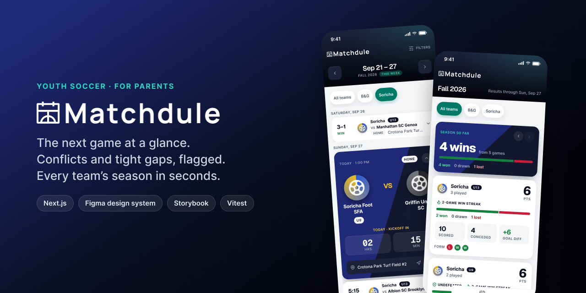
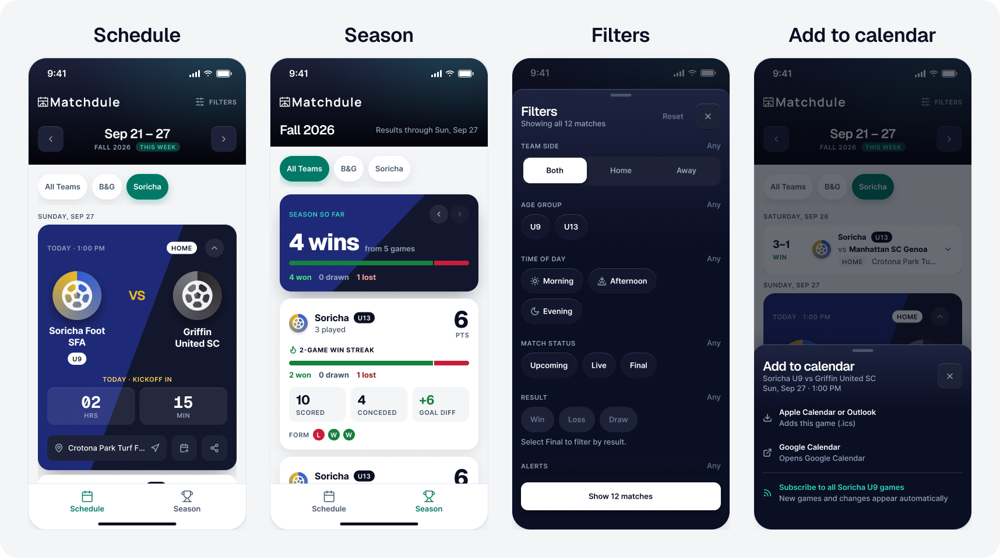

<p align="center">

  <picture>
    <source media="(prefers-color-scheme: dark)" srcset="public/matchdule-logo.svg">
    <source media="(prefers-color-scheme: light)" srcset="public/matchdule-logo-dark.svg">
    
  </picture>
</p>

[](https://github.com/slroberts/matchdule/actions/workflows/ci.yml)
[](https://matchdule.vercel.app)

**Your kid's soccer schedule, right from the sideline.**

I built Matchdule for my family. I got tired of looking up the schedule or waiting for the coach to post it.

Matchdule pulls league schedules into a cloud database and turns them into a UI that answers the questions parents actually ask: **Where do I need to be next? Can I make both games? How is the season going?** It flags overlapping games, tight turnarounds, and missing kickoff times before they become a problem — and keeps working at the field when the signal doesn't.

**[Open the app →](https://matchdule.vercel.app)**



## 📱 Screens



- **Schedule** — the next game is a dark "Versus" card with a countdown; everything else collapses to scannable rows.
- **Season** — each team's season at a glance: points, a W/D/L bar, form, and achievement flags.
- **Filters** — a bottom sheet that prevents zero-result combinations before you apply them.
- **Add to calendar** — one tap adds a game to Apple, Outlook or Google Calendar, or subscribes to every game for a team.

## 🏗 Architecture & Data Pipeline

Matchdule isn't just a frontend — it's a complete scheduling system:

1. **Schedule sync:** A Python + Playwright job reads the league's public schedule pages and cleans the data (team names, dates, venues) before storing it.
2. **Safe writes:** Games are deduplicated and upserted by game ID, stamped with a sync time, and games the league removed are pruned — only after a successful read, and only within their own season.
3. **Cloud database:** Everything lives in a **Supabase** PostgreSQL database.
4. **Scheduling engine:** The Next.js App Router loads the data server-side and runs it through a custom engine that calculates exact overlaps, turnaround gaps, live status, and season stats.
5. **Calendar feeds:** Route handlers turn the same data into standard `.ics` calendars — one per game, plus a subscribable feed per team (`/api/calendar/feed/soricha-u9.ics`) that's edge-cached so calendar apps polling for updates don't hit the database each time.
6. **Honest about freshness:** The sync time powers an "Updated 12 min ago" line in the app, which turns into a warning if the data is more than a day old.

> **A note on the sync job:** It runs on GitHub Actions twice a day and **stops immediately if the source site serves a bot check** instead of trying to get around it. When a run is stopped, the app keeps serving the last good data and tells parents when it's out of date.

## ✨ Features

**Schedule**

- **Focus stack:** The next game (or every live game) is highlighted as a dark "Versus" card; all other games collapse to _who · vs whom · where_ rows. The highlight never swaps while you're looking at it.
- **Live game states:** A countdown on game day, a live score with a pulse, final results, and **"Pending"** when a game is over but the score isn't posted yet.
- **Conflict & tight-gap detection:** The engine flags overlapping games and turnarounds under an hour — as a week-level alert parents can mute, plus markers on each affected game.
- **Season-aware:** "Next up" links to the next game, a _Final week_ marker, and a **"That's a wrap"** recap when a season ends, pointing to the next season's first game.

**Calendar**

- **Add to calendar:** Every upcoming game can go straight to Apple Calendar, Outlook, or Google Calendar. On iPhone it opens the native "Add to Calendar" sheet; games with a TBD kickoff become all-day events instead of a made-up time.
- **Subscribe to a team:** One tap subscribes to every game for a team (e.g. _Soricha U9_). New games and time changes appear automatically, and canceled games are crossed out rather than silently left behind. Apple devices get the native Subscribe dialog; everything else gets Google Calendar's "add by URL".

**Season tab**

- One season at a time with a ‹ › season pager, and a card per team with points, W/D/L proportions, goals, last-5 form, and **Undefeated / win-streak** flags.

**Filters**

- A bottom sheet that filters by team side, age group, time of day, game status, result, and alerts — and **prevents combinations that would return nothing** before you apply them. Active filters show as removable chips and persist across weeks.

**Everywhere**

- **Works offline:** Schedules you've opened load with no signal at all. On a weak connection, the app waits 3 seconds for fresh data, then shows the saved schedule instead of an endless spinner — and refreshes itself when the signal comes back. A page you've never opened shows a clear "You're offline" screen.
- **Shareable URLs:** The week, tab and season live in the URL (`?date=…&view=season&season=spring-2026`), so links can be shared and the back button works — without refetching data when switching tabs.
- **Server-rendered state:** The selected team and filters are stored in cookies and read on the server, so the page renders correctly on first load with no flash.
- **Loading, error & empty states:** A loading shell (the real header and tabs, with shimmering rows), a "Couldn't load the schedule · Try again" state, distinct "Rest week" / "No results" states, and a 404 — all built from one shared `EmptyState` component.
- **Share & directions:** The native share sheet (with a clipboard fallback on desktop) and one-tap directions, disabled for TBD fields.
- **Installable PWA:** Works from the home screen, with iOS status-bar and splash-screen handling.

## 🎨 Design System

Designed in **Figma first**, then built — every screen and state exists in both.

- **Tokens as the source of truth:** Figma variables in three collections — _Primitives_, _Color_ (Light / Dark modes) and _Density_ (Compact / Regular) — generate `styles/globals.css`, so design and code share the same names (`--color-text-secondary`, `--space-card-pad`, …).
- **Components mirror code:** Figma component properties match React props one-to-one (`Tone`, `Size`, `Status`, `Focused`), and every component's description names its source file.
- **Clear visual rules:** Dark = headline (header, the next-game card, season summary, week alerts) · a quiet pill with a colored icon = marker (tight gap, pending) · teal = "you are here" · green = winning.
- **Accessibility (WCAG 2.1 AA):** 44 px tap targets, contrast-checked tokens in both modes, a designed focus ring on every interactive component, icons never carry meaning alone, polite screen-reader announcements, keyboard focus management, and reduced-motion support.
- **No component library:** Every component is custom, built with Tailwind CSS and animated with Framer Motion.

## 🛠 Tech Stack

**Frontend**

- **Framework:** Next.js 16 (App Router, streaming + Suspense, route handlers), React 19, TypeScript
- **Styling:** Tailwind CSS 4 with a token-driven design system
- **Animations:** Framer Motion
- **Icons:** Lucide React
- **PWA & offline:** Serwist (configurator mode — the service worker is built after `next build`, so it works with Turbopack)

**Data & Automation**

- **Database:** Supabase (PostgreSQL)
- **Schedule sync:** Python & Playwright
- **Automation:** GitHub Actions (sync job + CI)

**Testing & Documentation**

- **Unit testing:** Vitest — **170+ tests** covering date and venue parsing, the scheduling engine, season stats, the match clock, and calendar (`.ics`) generation. They run in **both New York and UTC**, because the server renders in UTC while every game is in New York (this caught a real bug where late games landed on the wrong day).
- **Component testing:** Storybook 10 with a story for every component state, a pinned clock so time-based states render the same every run, interaction tests (muting alerts, keyboard tab switching, focus after removing a filter), and automated accessibility checks.
- **CI:** Every push runs lint, type-checking, the unit tests, and the Storybook tests. `npm run build` also runs the tests first, so a broken data rule can't deploy.

## 🚀 Run it locally

```bash
npm install
cp .env.example .env.local   # add your Supabase URL + publishable key
npm run dev                  # http://localhost:3000
```

| Command                  | What it does                                        |
| ------------------------ | --------------------------------------------------- |
| `npm run dev`            | Dev server (service worker off, so changes show up) |
| `npm test`               | Unit tests in watch mode                            |
| `npm run test:ci`        | Unit tests in New York and UTC                      |
| `npm run storybook`      | Component workshop on port 6006                     |
| `npm run test:storybook` | Stories as browser tests                            |
| `npm run build`          | Tests, a production build, then the service worker  |

> To try offline mode locally, run `npm run build && npm start`, open the app once, then go offline in your browser's dev tools.

## 🗺 Roadmap

- [x] Schedule sync (Python + Playwright) & Supabase integration
- [x] Core scheduling engine (overlaps, turnaround gaps, live status)
- [x] Match cards with share & directions
- [x] Alert system (conflicts, tight gaps, TBD times)
- [x] Filter sheet with zero-result prevention
- [x] Server-rendered state (cookies) & shareable URLs
- [x] Focus stack with the next-game "Versus" card
- [x] Season tab with achievement flags and season pager
- [x] Loading, error & data-freshness states
- [x] Unit + Storybook test suites in CI
- [x] **Add to calendar** for each game, plus a subscribable feed per team
- [x] **Offline support** — saved schedules work without signal
- [ ] Push notifications for schedule changes and night-before tight-gap reminders
